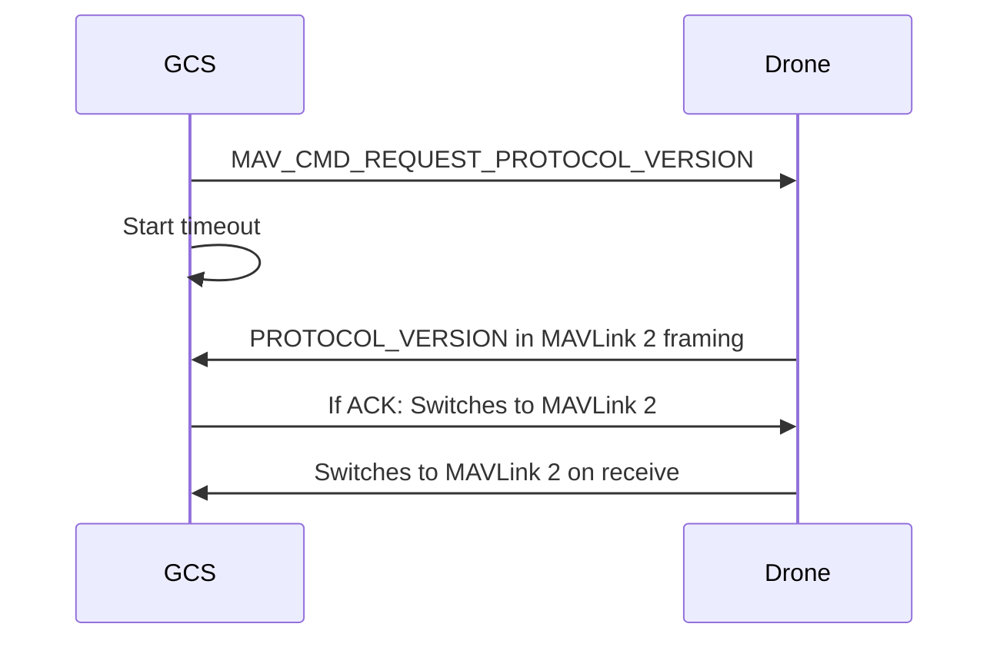
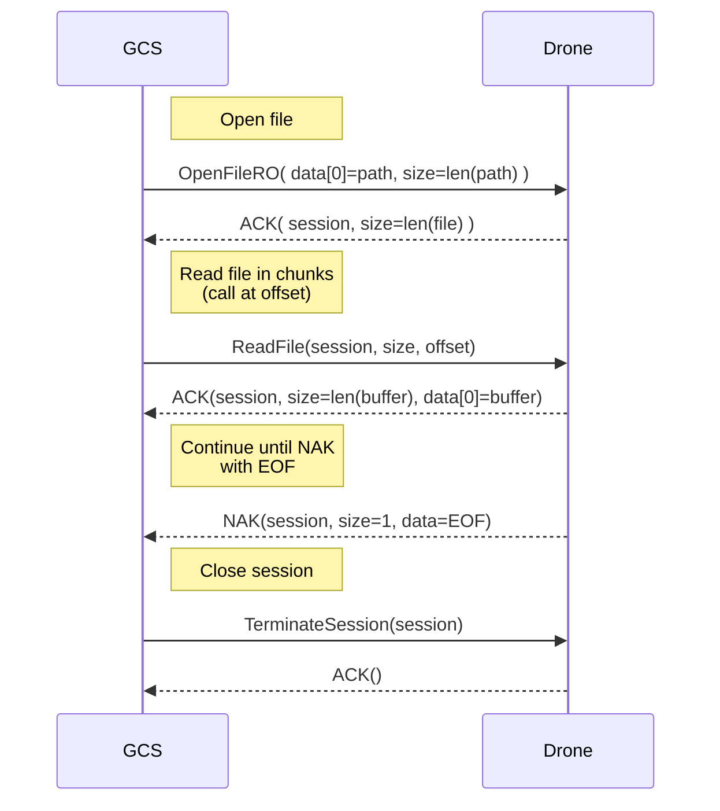

# Doc 1

Some text. 

Test

kdlfjaljas

## 2nd level heading

Some text. 

# A 3rd level heading

Some text. 

## Another Second level heading

Some text. 

## Asserts

> **Tip** This is a tip.

> **Note** This is a note.

> **Warning** This is a warning.

> **Todo** This is a todo.

This is a new tag test.